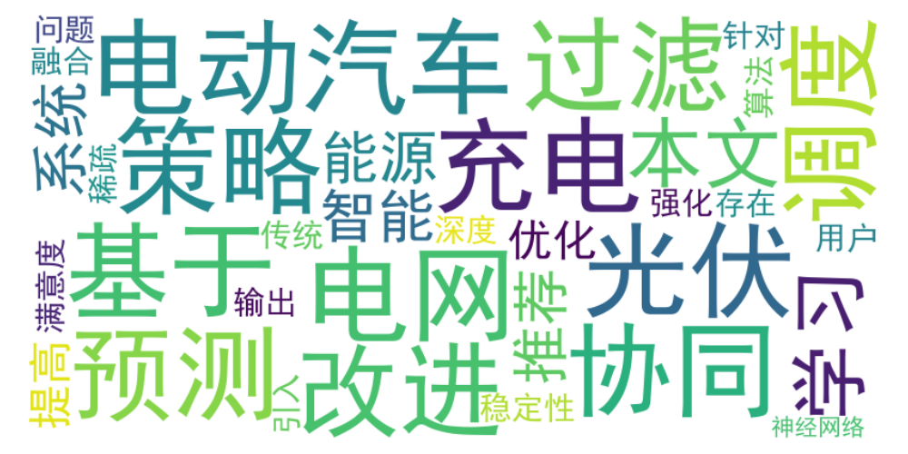

# 📘 Week01 学习笔记：关键词提取与词云可视化

本周目标是学习如何使用 Python 对科技文本进行预处理、关键词抽取与词云生成，为后续主题建模和语义分析打下基础。

---

## ✅ 本周核心技术点

### 1. 使用 Pandas 读取 CSV 数据

- 读取学术论文的标题和摘要字段
- 基础操作：`read_csv()`、`dropna()`、`tolist()`

### 2. 中文分词：jieba

- 精确模式分词：`jieba.cut(text)`
- 停用词过滤：去除无意义的虚词和高频功能词
- 关键词统计：使用 `collections.Counter` 实现词频统计

### 3. 可视化：wordcloud + matplotlib

- 使用词频结果生成词云图
- 设置字体（如 `simhei.ttf`）支持中文显示
- 自动保存图像为 PNG 文件

---

## 🗂️ 项目结构参考

```
TechMining-Learning-Path/
├── Week01_PythonBasics/
│   ├── keyword_analysis.py      # 本周核心脚本
│   └── notes.md                 # 本文件
├── data/
│   └── paper_data.csv           # 输入数据
├── assets/
│   └── wordcloud_example.png    # 输出词云图
```

---

## 📌 学到的经验

- 中文文本处理的第一步就是**分词 + 去停用词**
- 要注意路径问题：使用 `os.path.abspath(__file__)` 构造更稳健的文件引用方式
- 词云图可以帮助我们快速理解一个领域的高频词和主题感知

## 🖼️ 词云图示例



## 🧩 下周展望（Week02）

- 学习 TF-IDF 算法，提取更具区分度的关键词
- 使用 LDA 主题模型自动发现文本中隐含的主题结构
- 结合 pyLDAvis 可视化每个主题的关键词分布和相似性
